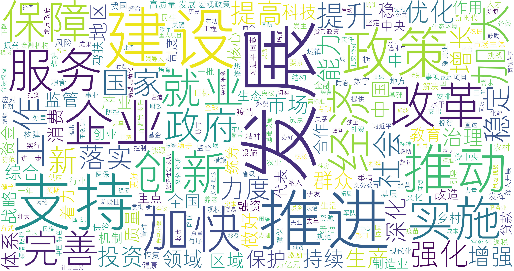

# Basic-Word-Cloud
Really basic simple word cloud.  
这是一个非常基础的词云生成工具，基于python.

## 版本
### v0.1  
Created on March.25, 2022.  
该版本直接输入txt文本，并在矩形区域内生成词云。颜色、蒙版等均为默认。  
提供了stopwords停用词文档。该文档由哈工大、四川大学、百度等停用词表去重整合而成。  
print语句中输出了计算耗时。  
以2022年政府工作报告全文为例，生成词云预览如下。  
ATTENTION: 默认字体为"方正GDC体 简 Light", 该字体为付费字体，不能商用。如果需要商用建议改为以下免费字体：  
> 思源字体、阿里巴巴普惠体、优设标题黑、霞鹜新晰黑、仓耳与墨、江城正义体、卓健橄榄简体、一点明体、江城圆体、江西拙楷体  
> 

### v0.2

